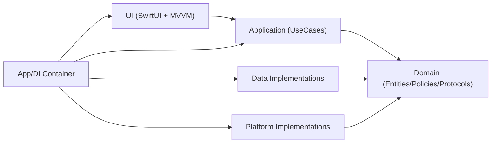
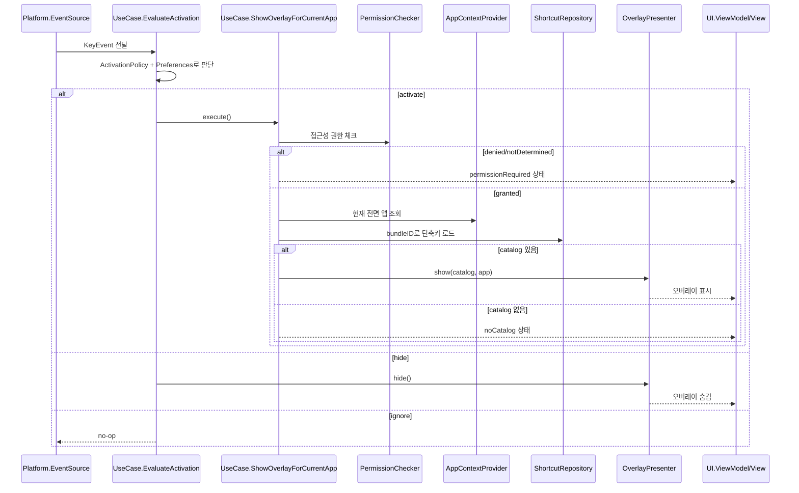

# AGENTS.md

## 프로젝트 개요
KeydeukKeydeuk는 macOS용 단축키 치트시트(오버레이) MVP 프로젝트다.

핵심 목표:
- Clean Architecture 원칙 유지
- SwiftUI + MVVM 적용
- 기능 단위 분리(FSD 정신) 반영
- MVP는 내장 JSON 카탈로그 기반으로 빠르게 개발
- 이후 AX 자동 추출/StoreKit 확장을 고려한 구조 유지

## 아키텍처 원칙
- Domain은 정책/규칙만 가진다.
- Domain은 SwiftUI, AppKit, AX API, UserDefaults, StoreKit 같은 구현 디테일을 모른다.
- UseCase(Application)는 시나리오를 조합한다.
- UI는 UseCase만 호출하고 상태를 표시한다.
- Platform/Data는 Domain Protocol(Port)을 구현한다.

## 현재 폴더 구조(단일 타겟)
```text
KeydeukKeydeuk/
  App/
    AppContainer.swift
    AppOrchestrator.swift
    KeydeukKeydeukApp.swift
  Domain/
    Entities/
    Policies/
    Protocols/
  Application/
    UseCases/
  Data/
    Repositories/
    Stores/
    Resources/
  Platform/
    Input/
    Permissions/
    AppContext/
    Overlay/
  UI/
    Overlay/
    Onboarding/
    Settings/
  Shared/
    Foundation/
```

## 레이어 책임
- App
  - DI 조립, 앱 부트스트랩, 유스케이스 오케스트레이션
- Domain
  - Entity/Value Object, 정책(Policy), 포트(Protocol)
- Application
  - 유스케이스(EvaluateActivation, Show/Hide Overlay, LoadShortcuts, UpdatePreferences)
- Data
  - 저장소/설정 저장 구현(JSON, UserDefaults)
- Platform
  - macOS 시스템 연동(NSEvent, AX 권한, 전면 앱 감지, 오버레이 호스트)
- UI
  - SwiftUI View + ViewModel(MVVM)

## 정적 의존성(컴파일 타임)


의존성 규칙:
- `UI -> Application -> Domain`
- `Data/Platform -> Domain` (Protocol 구현)
- Domain은 바깥 레이어에 의존하지 않는다.

## 런타임 제어 흐름(입력 -> 오버레이)


## 현재 MVP 범위
- 접근성 권한 상태 확인
- 글로벌 핫키 기반 트리거
- 현재 활성 앱 감지
- 오버레이 표시/숨김
- 검색 가능한 단축키 리스트 표시
- 내장 JSON 카탈로그(`Data/Resources/shortcuts_catalog.json`) 기반 단축키 로드

## 확장 포인트
- AX 기반 자동 추출 Repository 추가
- Overlay를 실제 NSWindow 레벨/포지션 제어로 확장
- BillingService 구현(StoreKit 결제/구독)
- Cache 계층 도입

## 구현 시 주의사항
- ViewModel이 Platform 구현체를 직접 참조하지 않기
- Domain 타입에 UI/AppKit 타입 섞지 않기
- UseCase가 정책 대신 메커니즘 코드를 직접 품지 않기
- 신규 기능 추가 시 먼저 Domain Port를 정의하고, 이후 Platform/Data에서 구현하기
