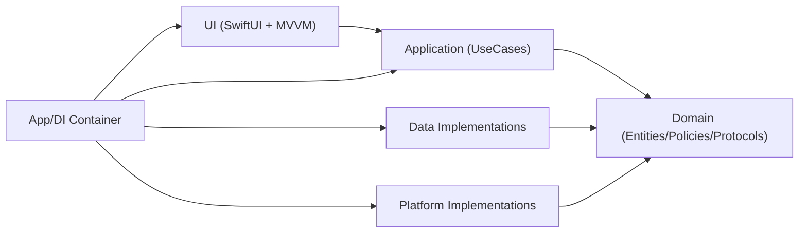
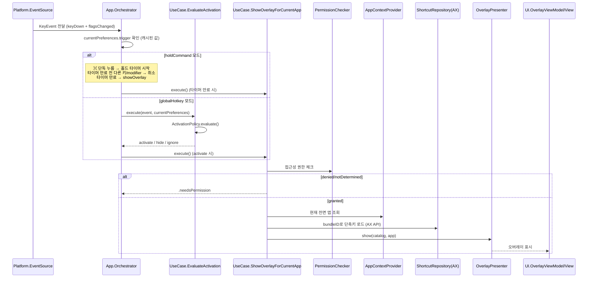
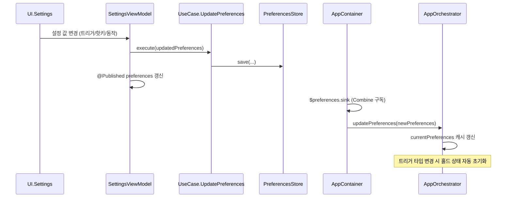
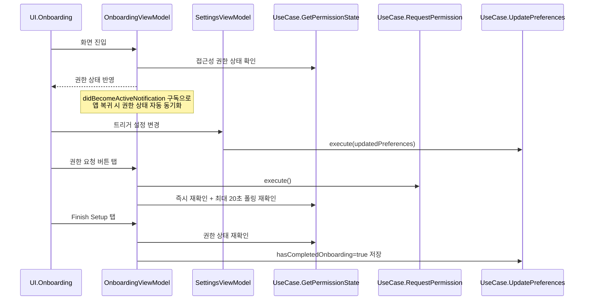
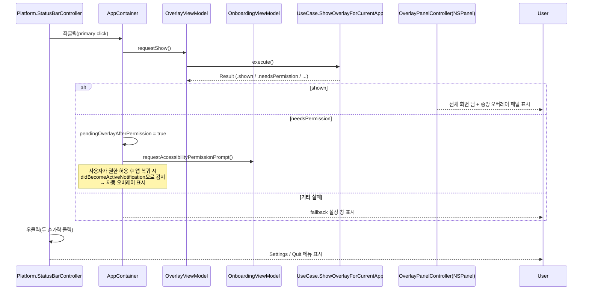

# AGENTS.md

## 프로젝트 개요
KeydeukKeydeuk는 macOS용 단축키 치트시트(오버레이) MVP 프로젝트다.

핵심 목표:
- Clean Architecture 원칙 유지
- SwiftUI + MVVM 적용
- 기능 단위 분리(FSD 정신) 반영
- AX API 기반 실시간 메뉴 바 단축키 추출
- 이후 StoreKit 확장을 고려한 구조 유지

현재 UX 방향(우선순위):
1. 최초 실행 시 온보딩 화면으로 권한/초기 설정 진행
2. 온보딩 완료 후에는 StatusBar 아이콘 중심으로 앱 사용
3. 기본 트리거: ⌘ Command 키 1초 이상 홀드 → 오버레이 표시 (트리거 전용, 떼도 유지)
4. 대안 트리거: 글로벌 핫키 조합(⌘⇧K 등) 토글 방식 지원
5. StatusBar 아이콘 좌클릭 시 오버레이 표시, 우클릭 시 메뉴 드롭다운
6. Settings 메뉴에서 탭 기반 설정 창(General/Theme/Help)을 열어 트리거·동작·권한·테마 설정 변경

## 아키텍처 원칙
- Domain은 정책/규칙만 가진다.
- Domain은 SwiftUI, AppKit, AX API, UserDefaults, StoreKit 같은 구현 디테일을 모른다.
- UseCase(Application)는 시나리오를 조합한다.
- UI는 UseCase만 호출하고 상태를 표시한다.
- Platform/Data는 Domain Protocol(Port)을 구현한다.
- ViewModel은 액터(사용자 역할)별로 분리한다(SRP).
- Orchestrator는 저장소(Store)를 직접 참조하지 않고, 값 객체(Value Object)만 의존한다.

## 현재 폴더 구조(단일 타겟)
```text
KeydeukKeydeuk/
  App/
    AppContainer.swift          # DI 조립, 라이프사이클, 라우팅
    AppOrchestrator.swift       # 키보드 이벤트 → 오버레이 제어
    KeydeukKeydeukApp.swift     # @main 진입점, SwiftUI Scene 정의
    OverlayPanelController.swift # NSPanel 생성/표시/숨김
  Domain/
    Entities/
      Activation.swift          # KeyModifiers, KeyEvent, ActivationDecision
      AppContext.swift           # 앱 컨텍스트 (bundleID, appName)
      Permission.swift           # PermissionState, PermissionRequirement
      Preferences.swift          # 사용자 설정 (트리거, 핫키, 동작, 통합 테마, 온보딩)
      Shortcut.swift             # 단축키 항목
      ShortcutCatalog.swift      # 앱별 단축키 카탈로그
    Policies/
      ActivationPolicy.swift     # 핫키 매칭 + ESC 숨김 판단
    Protocols/
      Ports.swift                # EventSource, PermissionChecker, PermissionGuide,
                                 # PreferencesStore, ShortcutRepository,
                                 # AppContextProvider, OverlayPresenter, BillingService
  Application/
    UseCases/
      EvaluateActivationUseCase.swift
      GetAccessibilityPermissionStateUseCase.swift
      HideOverlayUseCase.swift
      LoadPreferencesUseCase.swift
      LoadShortcutsForAppUseCase.swift
      OpenAccessibilitySettingsUseCase.swift
      RequestAccessibilityPermissionUseCase.swift
      ShowOverlayForCurrentAppUseCase.swift
      UpdatePreferencesUseCase.swift
  Data/
    Stores/
      UserDefaultsPreferencesStore.swift  # PreferencesStore 구현 (UserDefaults + JSON)
  Platform/
    AppContext/
      NSWorkspaceAppContextProvider.swift  # 전면 앱 감지
    Input/
      NSEventGlobalHotkeySource.swift      # 글로벌/로컬 키보드 이벤트 모니터
    MenuBar/
      AXMenuBarShortcutRepository.swift    # AX API 메뉴 바 단축키 추출
    Overlay/
      OverlayWindowHost.swift              # OverlayPresenter 구현
    Permissions/
      AXPermissionChecker.swift            # 접근성 권한 상태 확인
      SystemPermissionGuide.swift          # 권한 프롬프트 + 시스템 설정 열기
    StatusBar/
      StatusBarController.swift            # 상태바 아이콘/메뉴
  UI/
    Onboarding/
      OnboardingView.swift          # 권한 요청 UI (순수 View)
      OnboardingViewModel.swift     # 권한 상태, 온보딩 완료 흐름
    Overlay/
      AppWindowView.swift           # 메인 윈도우 (온보딩 or 실행 중 상태)
      OverlayPanelView.swift        # 전체 화면 딤 + 오버레이
      OverlaySceneState.swift       # 오버레이 상태 (isVisible, 앱 정보, 단축키)
      OverlayView.swift             # 멀티 컬럼 단축키 그리드
      OverlayViewModel.swift        # 오버레이 표시/숨김, 검색/필터링
      RootView.swift                # 온보딩 루트 뷰
    Settings/
      SettingsView.swift            # General/Theme/Help 탭 + 공용 섹션 컴포넌트
      SettingsViewModel.swift       # 트리거/핫키/동작 설정 관리
      SettingsWindowView.swift      # 탭 기반 설정 창 컨테이너
    Theme/
      AppTheme.swift                # 통합 테마 적용 + 컬러 팔레트 레지스트리
      ThemeModeStore.swift          # 현재 테마 상태 전파용 읽기 모델
      DisabledButtonAppearance.swift # 비활성(disabled) 버튼 가시성 보정 모디파이어
```

## 레이어 책임
- App
  - DI 조립, 앱 부트스트랩, 유스케이스 오케스트레이션, 라우팅
  - AppOrchestrator: 키보드 이벤트 수신 → 트리거 분기 → UseCase 실행
  - AppContainer: ViewModel/UseCase/Platform 조립, StatusBar 이벤트 라우팅
- Domain
  - Entity/Value Object, 정책(Policy), 포트(Protocol)
  - 순수 Swift, 외부 프레임워크 의존 없음
- Application
  - 유스케이스 9개: EvaluateActivation, Show/Hide Overlay, LoadShortcuts, LoadPreferences, UpdatePreferences, OpenAccessibilitySettings, GetAccessibilityPermissionState, RequestAccessibilityPermission
- Data
  - 설정 저장 구현 (UserDefaults + JSON 인코딩)
- Platform
  - macOS 시스템 연동 (NSEvent, AX 권한, AX 메뉴바 추출, 전면 앱 감지, 오버레이 호스트, 시스템 설정 열기, StatusBar 아이콘/메뉴)
- UI
  - SwiftUI View + ViewModel(MVVM)
  - ViewModel 3개 (SRP 기반 액터별 분리):
    - OverlayViewModel: 오버레이 표시/숨김, 단축키 검색/필터링
    - SettingsViewModel: 트리거/핫키/동작/테마 설정 변경 및 저장
    - OnboardingViewModel: 권한 상태 관리, 온보딩 완료 흐름

## 정적 의존성(컴파일 타임)


의존성 규칙:
- `UI -> Application -> Domain`
- `Data/Platform -> Domain` (Protocol 구현)
- Domain은 바깥 레이어에 의존하지 않는다.
- AppOrchestrator는 PreferencesStore를 직접 참조하지 않고, Preferences 값 객체만 의존한다.
- EvaluateActivationUseCase도 PreferencesStore 대신 Preferences를 파라미터로 받는다.

## 런타임 제어 흐름(입력 -> 오버레이)


## 런타임 제어 흐름(Preferences 전파)


## 런타임 제어 흐름(온보딩)


## 런타임 제어 흐름(StatusBar)


## 현재 MVP 범위
- 접근성 권한 상태 확인 및 설정 창/온보딩에서 실시간 자동 갱신(didBecomeActiveNotification)
- 온보딩 접근성 섹션은 `Request Permission` 단일 버튼으로 단순화
- 권한 요청 후 즉시 재확인 + 최대 20초 폴링으로 granted 자동 반영
- 권한 미획득 시 상태바 클릭 → 프롬프트만 표시, 허용 후 복귀 시 자동 오버레이 표시
- 권한 미획득 시 Finish Setup 버튼 비활성화
- **기본 트리거: ⌘ Command 홀드** (1초, 0.3~3.0초 조절 가능, 트리거 전용 — 떼도 오버레이 유지)
- 대안 트리거: 글로벌 핫키 조합(⌘⇧K 등) 토글 방식
- 트리거 모드별 분기 처리(AppOrchestrator → holdCommand / globalHotkey)
- Preferences 변경은 Combine으로 Orchestrator에 전파 (Store 직접 참조 없음)
- 현재 활성 앱 감지 (`NSWorkspace` 추적 + last known non-self app fallback)
- AX API 기반 실시간 메뉴 바 단축키 추출 (AXMenuBarShortcutRepository)
- 오버레이 표시/숨김 (NSPanel 기반 전체 화면 딤 + 멀티 컬럼 KeyCue 스타일 그리드)
- 검색 가능한 단축키 리스트 표시
- 핫키 프리셋/자동숨김 토글/트리거 타입/홀드 시간 설정 저장(UserDefaults)
- **테마 설정**: 통합 테마(System/Light/Dark/Graphite/Warm Paper/Nord Mist/High Contrast) 저장 및 앱 전역(온보딩/설정/오버레이) 적용
- **테마 팔레트 중앙화**: `UI/Theme/AppTheme.swift`에서 overlay/settings 컬러 토큰 관리
- 온보딩 완료 후 StatusBar 중심 동작(좌클릭 트리거, 우클릭 메뉴)
- 온보딩 완료 후 메인 창은 숨김(orderOut) 처리
- 오버레이 상단에 현재 포커스 앱 이름/아이콘/번들ID를 표시
- 현재 앱 카탈로그가 없더라도 빈 오버레이를 표시하고, "No shortcuts yet" 안내
- **설정 창: 탭 기반 레이아웃 (General / Theme / Help)**
  - General: Activation(트리거 타입·홀드 시간·핫키 프리셋), Behavior(자동숨김), Permissions(상태 뱃지·리프레시·설정 열기)
  - Theme: 통합 Theme 드롭다운(기본/커스텀 그룹), 중앙 Preview, 우측 하단 Save로 반영(비즉시 적용)
  - Help: placeholder (미구현)
  - 하단: Quit / Cancel / OK 버튼 바
  - 설정 저장 실패 시 인라인 에러 배너 표시
- **에러 핸들링**: os.Logger 진단 로그 + 인라인 UI 피드백 + graceful degradation
- **비활성 버튼 가시성**: 공통 모디파이어(`applyDisabledButtonAppearance`)로 disabled 상태 명도/채도 하향
- **ViewModel SRP**: OverlayViewModel / SettingsViewModel / OnboardingViewModel 분리

## 확장 포인트
- Theme 탭 확장 (커스텀 팔레트/타이포/레이아웃 프리셋)
- Help 탭 구현 (사용 가이드, FAQ, 버전 정보)
- Overlay를 실제 NSWindow 레벨/포지션 제어로 확장
- BillingService 구현(StoreKit 결제/구독)
- Cache 계층 도입 (AX 추출 결과 캐싱)
- 핫키 직접 입력 캡처 UI(프리셋 외 사용자 정의)
- 홀드 트리거 대상 modifier 선택 (⌘ 외 ⌥, ⌃ 등)
- Ports.swift를 도메인별 개별 파일로 분리
- 테스트 코드 추가 (Domain/Policy, UseCase 단위 테스트)

## 구현 시 주의사항
- ViewModel이 Platform 구현체를 직접 참조하지 않기
- Domain 타입에 UI/AppKit 타입 섞지 않기
- UseCase가 정책 대신 메커니즘 코드를 직접 품지 않기
- Orchestrator가 PreferencesStore를 직접 참조하지 않기 (Combine으로 값 전파)
- 신규 기능 추가 시 먼저 Domain Port를 정의하고, 이후 Platform/Data에서 구현하기
- 에러를 삼키지(swallow) 않기 — 최소한 os.Logger로 진단 로그 남기기
- ViewModel은 액터(사용자 역할)별로 분리하여 SRP 유지하기
- 전역 테마 전달이 필요할 때는 SettingsViewModel 전체를 넘기기보다 Theme 전용 읽기 모델/값 객체를 우선 검토하기
