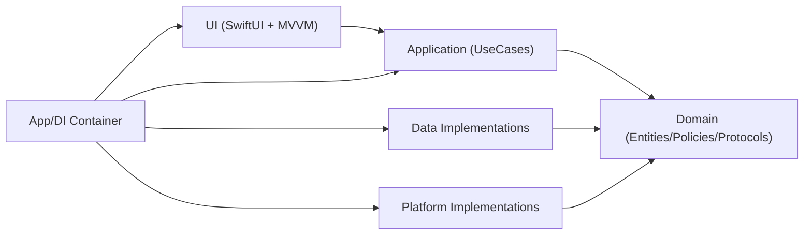
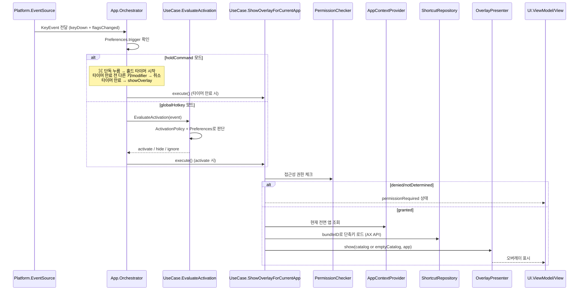
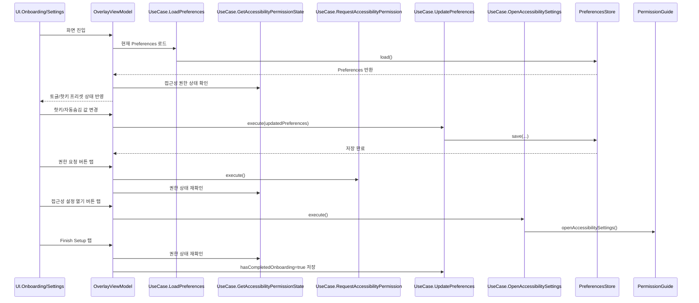
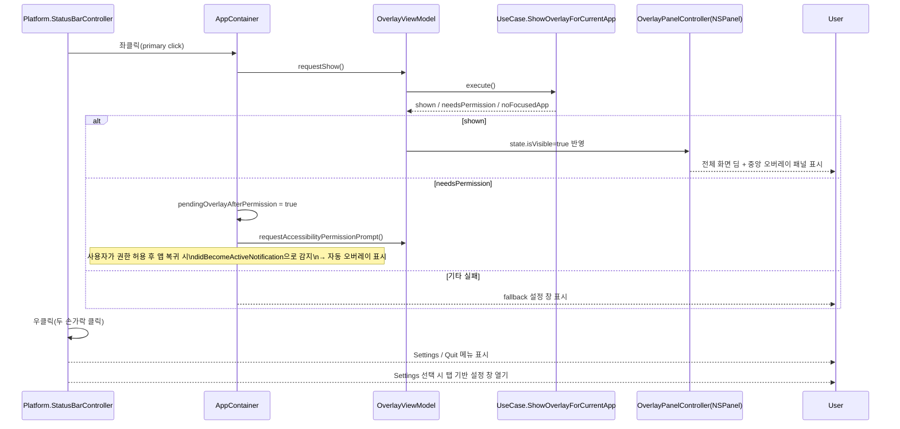

# AGENTS.md

## 프로젝트 개요
KeydeukKeydeuk는 macOS용 단축키 치트시트(오버레이) MVP 프로젝트다.

핵심 목표:
- Clean Architecture 원칙 유지
- SwiftUI + MVVM 적용
- 기능 단위 분리(FSD 정신) 반영
- AX API 기반 실시간 메뉴 바 단축키 추출 (내장 JSON 카탈로그는 fallback)
- 이후 StoreKit 확장을 고려한 구조 유지

현재 UX 방향(우선순위):
1. 최초 실행 시 온보딩 화면으로 권한/초기 설정 진행
2. 온보딩 완료 후에는 StatusBar 아이콘 중심으로 앱 사용
3. 기본 트리거: ⌘ Command 키 1초 이상 홀드 → 오버레이 표시 (트리거 전용, 떼도 유지)
4. 대안 트리거: 글로벌 핫키 조합(⌘⇧K 등) 토글 방식 지원
5. StatusBar 아이콘 좌클릭 시 오버레이 표시, 우클릭 시 메뉴 드롭다운
6. Settings 메뉴에서 탭 기반 설정 창(General/Theme/Help)을 열어 트리거·동작·권한 설정 변경

## 아키텍처 원칙
- Domain은 정책/규칙만 가진다.
- Domain은 SwiftUI, AppKit, AX API, UserDefaults, StoreKit 같은 구현 디테일을 모른다.
- UseCase(Application)는 시나리오를 조합한다.
- UI는 UseCase만 호출하고 상태를 표시한다.
- Platform/Data는 Domain Protocol(Port)을 구현한다.

## 현재 폴더 구조(단일 타겟)
```text
KeydeukKeydeuk/
  App/
    AppContainer.swift
    AppOrchestrator.swift
    KeydeukKeydeukApp.swift
  Domain/
    Entities/
    Policies/
    Protocols/
  Application/
    UseCases/
  Data/
    Repositories/
    Stores/
    Resources/
  Platform/
    Input/
    Permissions/
    AppContext/
    Overlay/
  UI/
    Overlay/
    Onboarding/
    Settings/
  Shared/
    Foundation/
```

## 레이어 책임
- App
  - DI 조립, 앱 부트스트랩, 유스케이스 오케스트레이션
- Domain
  - Entity/Value Object, 정책(Policy), 포트(Protocol)
- Application
  - 유스케이스(EvaluateActivation, Show/Hide Overlay, LoadShortcuts, LoadPreferences, UpdatePreferences, OpenAccessibilitySettings, GetAccessibilityPermissionState, RequestAccessibilityPermission)
- Data
  - 저장소/설정 저장 구현(JSON, UserDefaults)
- Platform
  - macOS 시스템 연동(NSEvent, AX 권한, 전면 앱 감지, 오버레이 호스트, 시스템 설정 열기, StatusBar 아이콘/메뉴)
- UI
  - SwiftUI View + ViewModel(MVVM), 온보딩/오버레이/설정 창 UI

## 정적 의존성(컴파일 타임)


의존성 규칙:
- `UI -> Application -> Domain`
- `Data/Platform -> Domain` (Protocol 구현)
- Domain은 바깥 레이어에 의존하지 않는다.

## 런타임 제어 흐름(입력 -> 오버레이)


## 런타임 제어 흐름(온보딩/설정)


## 런타임 제어 흐름(StatusBar)


## 현재 MVP 범위
- 접근성 권한 상태 확인 및 설정 창/온보딩에서 실시간 자동 갱신(didBecomeActiveNotification)
- 권한 요청 프롬프트 트리거(AX prompt) + 시스템 설정 열기를 단일 버튼으로 통합
- 권한 미획득 시 상태바 클릭 → 프롬프트만 표시, 허용 후 복귀 시 자동 오버레이 표시
- 권한 미획득 시 Finish Setup 버튼 비활성화
- **기본 트리거: ⌘ Command 홀드** (1초, 0.3~3.0초 조절 가능, 트리거 전용 — 떼도 오버레이 유지)
- 대안 트리거: 글로벌 핫키 조합(⌘⇧K 등) 토글 방식
- 트리거 모드별 분기 처리(AppOrchestrator → holdCommand / globalHotkey)
- 현재 활성 앱 감지 (`NSWorkspace` 추적 + last known non-self app fallback)
- AX API 기반 실시간 메뉴 바 단축키 추출 (AXMenuBarShortcutRepository)
- 오버레이 표시/숨김 (NSPanel 기반 전체 화면 딤 + 멀티 컬럼 KeyCue 스타일 그리드)
- 검색 가능한 단축키 리스트 표시
- 핫키 프리셋/자동숨김 토글/트리거 타입/홀드 시간 설정 저장(UserDefaults)
- 온보딩 완료 후 StatusBar 중심 동작(좌클릭 트리거, 우클릭 메뉴)
- 온보딩 완료 후 메인 창은 숨김(orderOut) 처리되며, 오버레이는 별도 패널에서 표시/숨김
- 오버레이 상단에 현재 포커스 앱 이름/아이콘/번들ID를 표시
- 현재 앱 카탈로그가 없더라도 빈 오버레이를 표시하고, "No shortcuts yet" 안내
- **설정 창: 탭 기반 레이아웃 (General / Theme / Help)**
  - General: Activation(트리거 타입·홀드 시간·핫키 프리셋), Behavior(자동숨김), Permissions(상태 뱃지·리프레시·설정 열기)
  - Theme / Help: placeholder (미구현)
  - 하단: Quit / Cancel / OK 버튼 바

## 확장 포인트
- Theme 탭 구현 (오버레이 외형/색상/레이아웃 커스터마이즈)
- Help 탭 구현 (사용 가이드, FAQ, 버전 정보)
- Overlay를 실제 NSWindow 레벨/포지션 제어로 확장
- BillingService 구현(StoreKit 결제/구독)
- Cache 계층 도입 (AX 추출 결과 캐싱)
- 핫키 직접 입력 캡처 UI(프리셋 외 사용자 정의)
- 홀드 트리거 대상 modifier 선택 (⌘ 외 ⌥, ⌃ 등)

## 구현 시 주의사항
- ViewModel이 Platform 구현체를 직접 참조하지 않기
- Domain 타입에 UI/AppKit 타입 섞지 않기
- UseCase가 정책 대신 메커니즘 코드를 직접 품지 않기
- 신규 기능 추가 시 먼저 Domain Port를 정의하고, 이후 Platform/Data에서 구현하기
