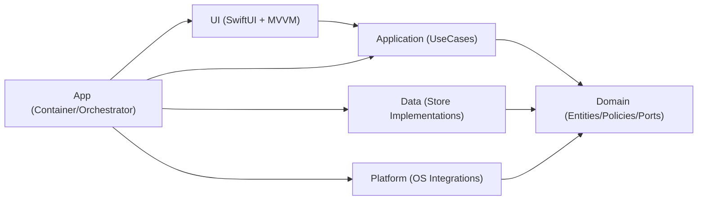
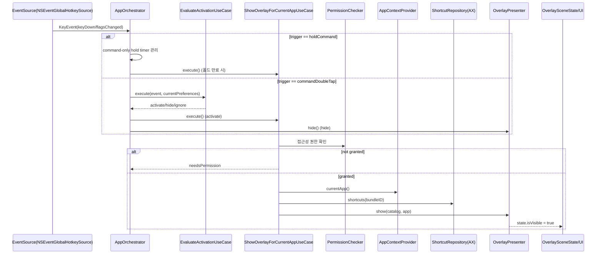
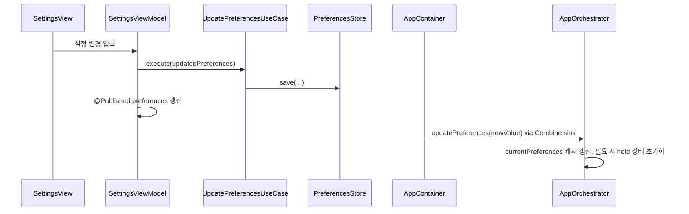
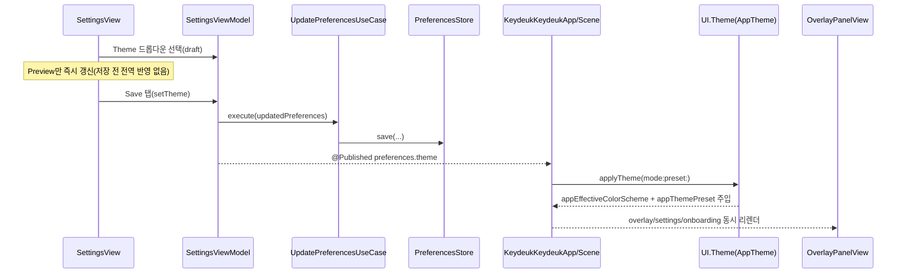
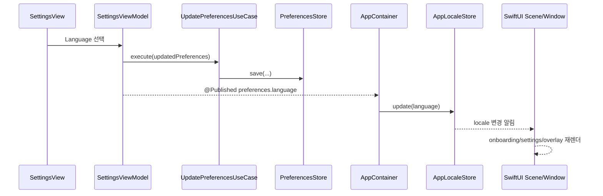
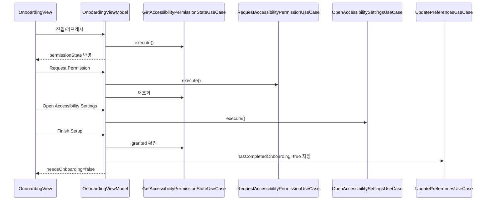
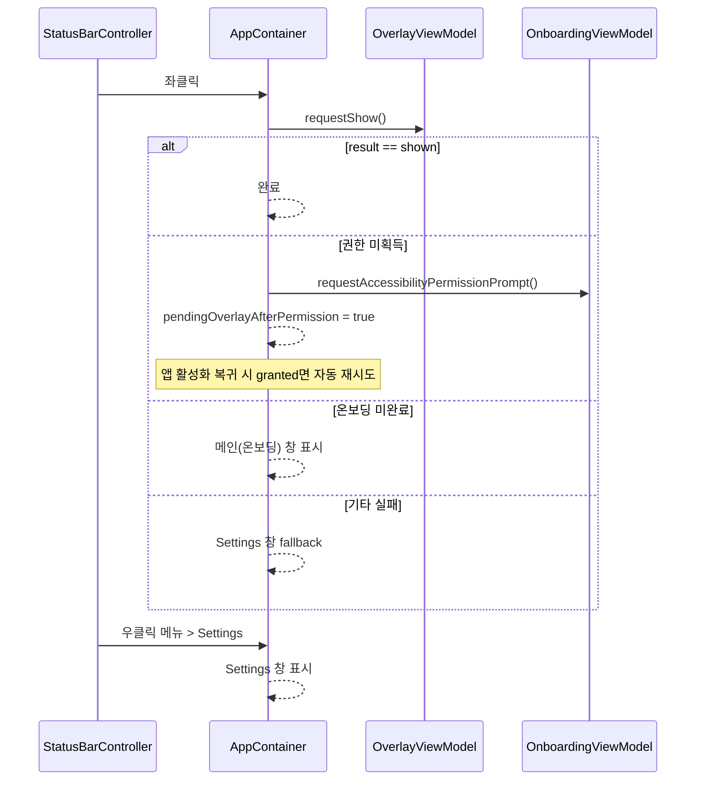
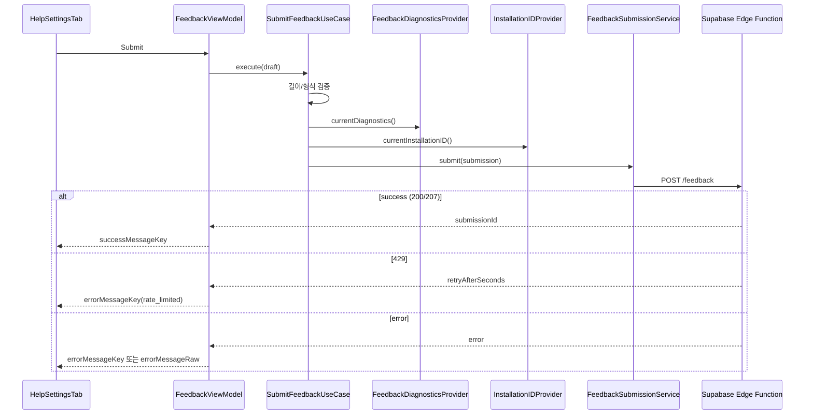

# KeydeukKeydeuk Architecture

## 1) 프로젝트 목적과 아키텍처 방향

KeydeukKeydeuk는 macOS에서 현재 활성 앱의 메뉴 바 단축키를 Accessibility(AX) API로 추출해 오버레이로 보여주는 MVP입니다.
또한 Settings > Help 탭에서 사용자 피드백을 수집해 Supabase 기반 파이프라인(DB/GitHub/Discord)으로 전달합니다.

핵심 설계 원칙:

- Clean Architecture: 정책과 구현 디테일을 분리
- MVVM: View는 상태 렌더링, ViewModel은 유스케이스 호출/상태 조합 담당
- 단방향 의존성: `UI -> Application -> Domain`, `Data/Platform -> Domain`
- Orchestrator는 저장소를 직접 참조하지 않고 `Preferences` 값 객체를 캐시해 동작
- SOLID 원칙 명세를 따른다

SOLID 원칙 명세 (SOLID Principles Specification):

### S - 단일 책임 원칙 (Single Responsibility Principle, SRP)

**정의**: 하나의 모듈은 오직 하나의 액터(actor)에 대해서만 책임을 져야 한다.

**설명**: 하나의 모듈은 오직 하나의 변경 이유만을 가져야 한다. 여기서 액터란 변경을 요구하는 주체로, 사람, 역할, 혹은 특정 이해관계 집단을 의미한다.  
하나의 모듈이 서로 다른 요구를 가진 여러 액터를 동시에 만족시키려 할 경우, 이는 SRP를 위반하게 된다.  
SRP는 함수의 개수가 아니라 **사람과 역할**에 관한 원칙이다.  
서로 다른 이유로 변경되는 시스템의 각 측면은, 변경의 영향을 최소화하기 위해 서로 분리된 모듈로 나뉘어야 한다.

### O - 개방-폐쇄 원칙 (Open/Closed Principle, OCP)

**정의**: 소프트웨어 엔티티는 확장에는 열려 있어야 하고, 수정에는 닫혀 있어야 한다.

**설명**: 소프트웨어 모듈의 동작은 소스 코드를 수정하지 않고도 확장 가능해야 한다.  
이는 추상화와 다형성을 통해 달성되며, 기존에 잘 동작하던 코드를 변경하는 대신 새로운 코드를 추가함으로써 기능을 확장한다.  
목표는 한 번 구현된 모듈은 더 이상 변경되지 않으면서도, 추상화의 새로운 구현을 통해 시스템의 동작을 확장할 수 있도록 설계하는 것이다.

### L - 리스코프 치환 원칙 (Liskov Substitution Principle, LSP)

**정의**: 상위 클래스의 객체는 해당 클래스를 상속한 하위 클래스의 객체로 대체되더라도 애플리케이션의 동작이 깨져서는 안 된다.

**설명**: 하위 타입은 반드시 상위 타입을 **행동적으로 대체 가능**해야 한다. 이는 단순한 문법적 호환성을 넘어, 의미적 호환성을 요구한다.  
하위 타입은 상위 타입이 정의한 암묵적·명시적 계약을 모두 준수해야 하며,  
사전 조건을 강화해서도 안 되고, 사후 조건을 약화해서도 안 되며, 상위 타입이 정의한 불변식을 위반해서도 안 된다.  
이 원칙은 상속 구조가 진정한 “is-a” 관계를 표현하며, 일관된 동작을 보장하도록 한다.

### I - 인터페이스 분리 원칙 (Interface Segregation Principle, ISP)

**정의**: 클라이언트는 자신이 사용하지 않는 인터페이스에 의존하도록 강요받아서는 안 된다.

**설명**: 어떤 클라이언트도 사용하지 않는 메서드를 구현하도록 강제되어서는 안 된다.  
하나의 범용 인터페이스보다는, 여러 개의 구체적이고 목적에 맞는 인터페이스가 바람직하다.  
인터페이스는 구현체의 관점이 아니라, **클라이언트의 관점**에서 설계되어야 한다.  
클라이언트가 필요하지 않은 메서드에 의존하게 되면 불필요한 결합도가 생기며, 인터페이스 변경 시 영향을 받는 범위가 커지게 된다.

### D - 의존성 역전 원칙 (Dependency Inversion Principle, DIP)

**정의**: 고수준 모듈은 저수준 모듈에 의존해서는 안 되며, 둘 다 추상화에 의존해야 한다.

**설명**: 의존성은 구체가 아니라 추상화를 향해 흐르도록 설계되어야 한다.  
고수준 정책은 저수준의 세부 구현에 의존해서는 안 되며, 대신 둘 다 추상화에 의존해야 한다.  
또한 추상화는 세부 사항에 의존해서는 안 되고, 세부 사항이 추상화에 의존해야 한다.  
이 원칙은 전통적인 의존 관계를 뒤집어, 고수준 모듈이 저수준 모듈에 직접 의존하던 구조를 제거함으로써  
비즈니스 규칙에 영향을 주지 않고도 구체 구현을 교체할 수 있는 유연한 아키텍처를 가능하게 한다.

---

## 2) 레이어 개요

### App 레이어

역할:

- DI 조립(실제 구현체와 유스케이스 결선)
- 앱 수명주기 시작/상태바/윈도우 라우팅
- 키보드 이벤트 기반 오버레이 제어 오케스트레이션

특징:

- `AppContainer`에서 전 구성요소를 생성/연결
- `AppOrchestrator`가 트리거 모드(`holdCommand`, `commandDoubleTap`) 분기 처리
- 온보딩 완료 시 앱을 accessory 모드로 전환하고 메인 윈도우 숨김

### Domain 레이어

역할:

- 순수 비즈니스 모델/규칙 정의
- 외부 프레임워크(AppKit/SwiftUI/AX/UserDefaults) 비의존

특징:

- `Preferences`, `KeyEvent`, `ActivationDecision` 같은 정책 중심 타입 보유
- `ActivationPolicy`로 핫키 매칭/ESC hide 규칙 캡슐화
- Port(Protocol)로 외부 의존 역전

### Application 레이어

역할:

- 유스케이스 단위로 시나리오 조합
- UI가 호출할 진입점 제공

특징:

- 저장/로딩/권한/오버레이 표시/입력판단을 작은 UseCase로 분할
- 정책은 Domain Policy에 위임, 메커니즘은 Port 구현체에 위임

### Data 레이어

역할:

- 영속화 구현

특징:

- `UserDefaultsPreferencesStore`: `PreferencesStore` 구현
- JSON encode/decode로 설정 저장
- 손상 데이터는 기본값(`Preferences.default`)으로 복구

### Platform 레이어

역할:

- macOS 시스템 연동(입력 이벤트, AX, 권한, 상태바, 창/패널, 현재 앱 감지)

특징:

- Domain Port 구현체 집합
- AppKit/AX API 접근은 이 레이어에 한정

### UI 레이어

역할:

- SwiftUI 화면 렌더링
- ViewModel이 UseCase 호출 결과를 상태로 노출

특징:

- `OnboardingViewModel`, `SettingsViewModel`, `OverlayViewModel`로 역할 분리(SRP)
- `OverlaySceneState`를 shared state로 사용

---

## 3) 실제 디렉터리/컴포넌트 맵

```text
KeydeukKeydeuk/
  App/
    AppContainer.swift
    AppRuntimeCoordinator.swift
    AppOrchestrator.swift
    KeydeukKeydeukApp.swift
    OverlayPanelController.swift
    OverlayScenePresenter.swift
    AppWindowCoordinator.swift

  Domain/
    Entities/
      Activation.swift
      AppContext.swift
      Feedback.swift
      Permission.swift
      Preferences.swift
      Shortcut.swift
      ShortcutCatalog.swift
    Policies/
      ActivationPolicy.swift
    Protocols/
      Ports.swift

  Application/
    UseCases/
      EvaluateActivationUseCase.swift
      GetAccessibilityPermissionStateUseCase.swift
      HideOverlayUseCase.swift
      LoadPreferencesUseCase.swift
      LoadShortcutsForAppUseCase.swift
      OpenAccessibilitySettingsUseCase.swift
      RequestAccessibilityPermissionUseCase.swift
      ShowOverlayForCurrentAppUseCase.swift
      SubmitFeedbackUseCase.swift
      UpdatePreferencesUseCase.swift

  Data/
    Stores/
      UserDefaultsPreferencesStore.swift

  Platform/
    AppContext/
      NSWorkspaceAppContextProvider.swift
    Feedback/
      AppFeedbackDiagnosticsProvider.swift
      SupabaseFeedbackService.swift
      UserDefaultsInstallationIDProvider.swift
    Input/
      NSEventGlobalHotkeySource.swift
    MenuBar/
      AXMenuBarShortcutRepository.swift
    Permissions/
      AXPermissionChecker.swift
      SystemPermissionGuide.swift
    StatusBar/
      StatusBarController.swift

  UI/
    Localization/
      AppLocaleStore.swift
      L10n.swift
    Onboarding/
      OnboardingView.swift
      OnboardingViewModel.swift
    Overlay/
      AppWindowView.swift
      OverlayPanelView.swift
      OverlaySceneState.swift
      OverlayView.swift
      OverlayViewModel.swift
      RootView.swift
    Settings/
      FeedbackViewModel.swift
      SettingsView.swift
      SettingsViewModel.swift
      SettingsWindowView.swift
    Theme/
      AppTheme.swift
      ThemeModeStore.swift
```

---

## 4) 레이어별 컴포넌트 상세

## App

### `App/KeydeukKeydeukApp.swift`

- SwiftUI 앱 진입점(`@main`)
- `AppContainer`에서 주입된 VM을 Scene에 연결
- 앱 시작 시 `container.start()` 호출
- 루트 Scene에 `applyTheme(mode:preset:)`를 적용해 앱 전역 테마 동기화

### `App/AppContainer.swift`

- 전체 DI 조립 중심
- Port 구현체 생성(Data/Platform)
- UseCase 생성(Application)
- ViewModel 생성(UI)
- AppWindowCoordinator/RuntimeCoordinator/Orchestrator를 결선

### `App/AppRuntimeCoordinator.swift`

- 앱 런타임 이벤트 바인딩 담당
- `SettingsViewModel.$preferences` 구독 → Orchestrator/Theme/Locale/StatusBar 동기화
- StatusBar 좌/우클릭 액션 라우팅
- 앱 활성화 복귀 시 접근성 권한 재확인 후 자동 오버레이 표시
- 온보딩 상태 변경 시 AppWindowCoordinator 프레젠테이션 적용

### `App/AppOrchestrator.swift`

- `EventSource`를 구독하여 키 이벤트 처리
- 현재 `Preferences`를 내부 캐시(`currentPreferences`)
- 트리거 분기:
  - `holdCommand`: ⌘ 단독 홀드 타이머 만료 시 오버레이 표시
  - `commandDoubleTap`: `EvaluateActivationUseCase` 결과에 따라 show/hide/ignore
- 트리거 타입 변경 시 홀드 상태 초기화

### `App/OverlayPanelController.swift`

- `OverlaySceneState.isVisible` 구독
- `NSPanel` 생성/표시/숨김 담당
- 마우스 위치 기준 대상 스크린을 찾아 풀스크린 오버레이 패널 표시
- `OverlayPanelView`에 Theme/Locale 상태(`ThemeModeStore`, `AppLocaleStore`) 전달

### `App/OverlayScenePresenter.swift`

- `OverlayPresenter` 구현
- 오버레이 표시 시 `OverlaySceneState` 갱신(appName, bundleID, icon, shortcuts, isVisible)
- 앱 아이콘 로딩 담당

### `App/AppWindowCoordinator.swift`

- 앱 activation policy(`regular`/`accessory`) 및 윈도우 노출 정책 적용
- 온보딩 창 전면 표시(main window 포커싱) 담당
- 설정 창 생성/재사용/타이틀 업데이트 담당

---

## Domain

### Entities

### `Domain/Entities/Activation.swift`

- `KeyModifiers`(OptionSet)
- `KeyEvent`(keyCode/modifiers/keyDown/flagsChanged)
- `ActivationDecision`(`activate`, `hide`, `ignore`)

### `Domain/Entities/Preferences.swift`

- 트리거 타입, 핫키 키코드/모디파이어, 홀드 시간, auto-hide, 통합 테마(`Preferences.Theme`), 온보딩 완료 여부
- 기본값(`.default`)과 디코딩 시 기본값 복구 로직 보유

### `Domain/Entities/AppContext.swift`

- 현재 앱 식별 정보(`bundleID`, `appName`)

### `Domain/Entities/Permission.swift`

- `PermissionState`, `PermissionRequirement`

### `Domain/Entities/Shortcut.swift`, `ShortcutCatalog.swift`

- 단축키 단위 모델 / 앱 단위 카탈로그 모델

### `Domain/Entities/Feedback.swift`

- 피드백 폼 도메인 타입(`FeedbackDraft`, `FeedbackSubmission`, `FeedbackSubmissionResult`)
- 입력 제약 상수(`maxTitleLength=50`, `maxMessageLength=500`, `maxEmailLength=120`)
- 피드백 서비스 경계 에러 타입(`FeedbackSubmissionServiceError`) 정의
- 채널 구현 디테일(GitHub URL 등)은 도메인에서 노출하지 않음

### Policies

### `Domain/Policies/ActivationPolicy.swift`

- `ActivationPolicy` 추상화
- `DefaultActivationPolicy` 구현:
  - global hotkey 일치 시 `activate`
  - ESC + autoHideOnEsc 시 `hide`
  - 그 외 `ignore`

### Protocols (Ports)

### `Domain/Protocols/Ports.swift`

- 입력, 권한, 저장소, 단축키 조회, 현재 앱 조회, 오버레이 표시 등 외부 경계 인터페이스 정의
- 피드백 경계 Port 정의:
  - `FeedbackSubmissionService`
  - `FeedbackDiagnosticsProvider`
  - `InstallationIDProvider`
- 구현체는 Data/Platform에서 제공

---

## Application (UseCases)

### `EvaluateActivationUseCase`

- `ActivationPolicy` 실행 래퍼

### `GetAccessibilityPermissionStateUseCase`

- 접근성 권한 상태 조회

### `RequestAccessibilityPermissionUseCase`

- 접근성 권한 요청 프롬프트 트리거

### `OpenAccessibilitySettingsUseCase`

- 시스템 접근성 설정 화면 열기

### `LoadPreferencesUseCase`

- 현재 설정 로드

### `UpdatePreferencesUseCase`

- 설정 검증 후 저장
- 최소 검증: keyCode 음수 방지

### `LoadShortcutsForAppUseCase`

- 앱 번들 ID 기준 단축키 카탈로그 조회

### `ShowOverlayForCurrentAppUseCase`

- 오버레이 표시 시나리오 핵심
- 흐름: 권한 체크 -> 현재 앱 조회 -> 단축키 로드(실패 시 빈 카탈로그로 degrade) -> presenter.show
- 반환값으로 상위 라우팅(`shown`, `needsPermission`, `noFocusedApp`)

### `HideOverlayUseCase`

- presenter.hide 호출

### `SubmitFeedbackUseCase`

- 피드백 제출 시나리오
- 흐름: draft 정규화/검증 -> diagnostics 조회 -> installation ID 조회 -> submission service 호출
- 429(rate limit) 등 전송 오류는 상위(UI)로 전달해 인라인 메시지 처리

---

## Data

### `Data/Stores/UserDefaultsPreferencesStore.swift`

- `PreferencesStore` 구현
- 저장 키: `preferences.v1`
- 디코딩 실패/미존재 시 기본값 반환 + 진단 로그

---

## Platform

### AppContext

### `Platform/AppContext/NSWorkspaceAppContextProvider.swift`

- frontmost app를 `AppContext`로 변환
- self app 제외
- activation notification으로 `lastKnownApp` 캐시 유지

### Input

### `Platform/Input/NSEventGlobalHotkeySource.swift`

- global monitor로 `keyDown` + `flagsChanged` 수집
- local monitor로 앱 포커스 상태에서도 `flagsChanged` 수집(⌘ 릴리즈 감지)
- `NSEvent` -> `KeyEvent` 매핑

### MenuBar

### `Platform/MenuBar/AXMenuBarShortcutRepository.swift`

- AX 트리 순회(`AXApplication -> AXMenuBar -> AXMenuBarItem -> AXMenu -> AXMenuItem`)
- 문자 기반/가상키 기반 단축키 추출
- modifier 비트 조합을 Key symbol(⌘⌥⇧⌃) 문자열로 변환
- 실패 시 빈 카탈로그 반환하여 기능 저하 허용(graceful degradation)

### Permissions

### `Platform/Permissions/AXPermissionChecker.swift`

- AX 권한 상태 조회 (`AXIsProcessTrusted`)

### `Platform/Permissions/SystemPermissionGuide.swift`

- AX 권한 프롬프트 요청
- 시스템 접근성 설정 URL 오픈

### StatusBar

### `Platform/StatusBar/StatusBarController.swift`

- Status item 생성(KD)
- 좌클릭: primary action callback
- 우클릭: Settings/Quit 메뉴
- 메뉴 타이틀은 외부(AppContainer)에서 주입받아 렌더링만 수행

### Feedback

### `Platform/Feedback/AppFeedbackDiagnosticsProvider.swift`

- 앱 버전/빌드/OS/Locale/BundleID 진단 정보 수집

### `Platform/Feedback/UserDefaultsInstallationIDProvider.swift`

- 설치 단위 식별자(`installation_id`) 생성/보관(UserDefaults)
- 재설치/데이터 초기화 전까지 동일 키 유지

### `Platform/Feedback/SupabaseFeedbackService.swift`

- Supabase Edge Function `/functions/v1/feedback` 호출
- 요청 바디 직렬화(email/title/message/diagnostics/installationId)
- 실패 응답을 `FeedbackSubmissionServiceError`로 매핑해 상위 레이어로 전달
- 응답 처리:
  - 200/207 성공 처리
  - 429 `retryAfterSeconds` 파싱 후 rate-limit 에러로 매핑
  - 기타 4xx/5xx 에러 메시지 추출

---

## UI (View + ViewModel)

### Onboarding

### `UI/Onboarding/OnboardingViewModel.swift`

- 권한 상태 조회/요청/리프레시
- 온보딩 완료 저장(`hasCompletedOnboarding=true`)
- `needsOnboarding`, `permissionHintKey` 상태 관리

### `UI/Onboarding/OnboardingView.swift`

- 권한 상태 표시/버튼 UI

### Overlay

### `UI/Overlay/OverlaySceneState.swift`

- 오버레이 표시 상태의 단일 소스

### `UI/Overlay/OverlayViewModel.swift`

- `showOverlay`/`hideOverlay` 유스케이스 호출
- 검색 쿼리 기반 단축키 필터링
- `OverlaySceneState` 변화를 ViewModel 객체 변경으로 브리지

### `UI/Overlay/OverlayView.swift`

- 앱 정보 헤더, 검색창, 섹션별 단축키 그리드, 빈 상태 표시
- `ThemePalette` 토큰(프리셋 기반)을 사용해 통합 테마 톤을 렌더링

### `UI/Overlay/OverlayPanelView.swift`

- 배경 딤 + 탭/ESC hide 트리거
- `applyTheme(mode:preset:)`를 통해 패널 appearance와 colorScheme 적용

### `UI/Overlay/RootView.swift`, `AppWindowView.swift`

- 온보딩/실행중 상태 분기 렌더링

### Settings

### `UI/Settings/SettingsViewModel.swift`

- 설정 읽기/수정 API 제공
- 트리거 타입, 홀드 시간, auto-hide 토글, 통합 테마, 앱 언어(`Preferences.Language`) 반영
- 저장 실패 시 인라인 오류 키(`errorMessageKey`) 관리

### `UI/Settings/SettingsWindowView.swift`

- 탭 기반 설정 창 컨테이너(General/Theme/Help)
- 활성화 시 권한 상태 리프레시

### `UI/Settings/SettingsView.swift`

- General 탭(Activation/Behavior/Permissions)
- Theme 탭(통합 Theme 드롭다운 + Preview + Save)
- Help 탭(피드백 제출 폼):
  - Email(선택), Title(최대 50), Message(최대 500)
  - 메시지 placeholder, 입력 길이 제한, 제출 상태/에러 메시지 표시

### `UI/Settings/FeedbackViewModel.swift`

- 피드백 폼 상태(email/title/message), 카운터, submit 가능 여부 관리
- `SubmitFeedbackUseCase` 호출 결과를 로컬라이즈 키(success/error) 또는 서버 raw 메시지로 노출

### `UI/Theme/AppTheme.swift`

- `ThemeMode` -> `ColorScheme`/`NSAppearance` 매핑
- `ThemePreset`별 `ThemePalette` 레지스트리로 Settings/Overlay 컬러 토큰 중앙 관리
- `applyTheme(mode:preset:)`로 앱 전역 테마/환경값(`appEffectiveColorScheme`, `appThemePreset`) 주입

### `UI/Localization/AppLocaleStore.swift`, `UI/Localization/L10n.swift`

- `Preferences.Language` 값을 앱 전역 `Locale`로 해석/보관
- `KeydeukKeydeukApp`과 설정 창/오버레이 루트에 `.environment(\.locale, ...)` 주입
- `L10n`은 App 레이어(예: StatusBar 메뉴 타이틀 계산)에서 문자열을 안전하게 조회하는 헬퍼

---

## 5) 정적 의존성(컴파일 타임)



의존성 규칙:

- `UI -> Application -> Domain`
- `Data/Platform -> Domain`
- Domain은 외부 레이어를 모름
- App은 조립/런타임 제어 전용

---

## 6) 런타임 제어 흐름

## 6.1 입력 이벤트 -> 오버레이



## 6.2 Settings 변경 -> Orchestrator 전파



## 6.2-1 Theme 변경 -> 전역 UI 반영



## 6.2-2 Language 변경 -> 전역 Locale 반영



## 6.3 온보딩/권한 획득 흐름



## 6.4 StatusBar 상호작용



## 6.5 Feedback 제출/레이트리밋



---

## 7) 상태/데이터 경계

핵심 상태:

- `Preferences`: 영속 설정 데이터
- `OverlaySceneState`: 오버레이 화면 상태(UI 표시용)
- `OnboardingViewModel.permissionState`: 권한 상태
- `FeedbackViewModel` 상태(email/title/message, isSubmitting, successMessageKey/errorMessageKey/errorMessageRaw)
- `AppLocaleStore.locale`: 앱 전역 Locale 상태
- `EnvironmentValues.appEffectiveColorScheme`: 테마 해석 결과(UI 렌더링용)

경계:

- Persistent state: `UserDefaultsPreferencesStore`
- Persistent state (feedback): `UserDefaultsInstallationIDProvider`의 `installation_id`
- Runtime UI state: `OverlaySceneState` + 각 ViewModel `@Published`
- OS integration state: `NSWorkspace`, `NSEvent`, `AX` API 결과

---

## 8) 에러 처리 및 Graceful Degradation

현재 구현 전략:

- 설정 디코딩 실패 -> 기본값으로 복구
- AX 추출 실패/미지원 -> 빈 카탈로그로 오버레이 표시 유지
- 권한 미획득 -> 온보딩/권한 유도 메시지로 분기
- 설정 저장 실패 -> `SettingsViewModel.errorMessageKey`로 인라인 표시
- 진단 로그: `os.Logger` 카테고리별 기록

---

## 9) 아키텍처 적합성 체크

현재 코드가 지키는 점:

- Domain은 프레임워크 비의존
- UseCase는 Port 의존, 구현체 직접 의존 없음
- UI ViewModel은 Platform 구현체 직접 참조 없음
- Preferences 저장소는 AppContainer 조립 지점에서만 연결
- Orchestrator는 Store 직접 접근 없이 값(`Preferences`)만 사용

주의/개선 후보:

- `PermissionState.denied`는 현재 체커에서 직접 반환되지 않아(대부분 `notDetermined`) 상태 세분화 여지 존재
- `ShowOverlayForCurrentAppUseCase.Result.noCatalog` 케이스는 enum에 있으나 현재 반환 경로는 실질적으로 `shown` 중심
- Domain Port 파일(`Ports.swift`)은 기능별 파일 분리 시 탐색성 향상 가능
- 피드백 서비스 에러(`FeedbackSubmissionServiceError`)를 도메인 친화적 코드(예: 네트워크/서버 범주)로 더 추상화하면 HTTP 세부 의존을 더 줄일 수 있음

---

## 10) 확장 시 권장 절차

1. Domain에 먼저 모델/Port/정책 정의
2. Application에 UseCase 추가(시나리오 단위)
3. Data/Platform에서 Port 구현
4. AppContainer에서 DI 결선
5. ViewModel에 액션/상태 추가, View는 표시/입력만 담당

이 순서를 유지하면 Clean Architecture의 의존성 규칙을 깨지 않고 기능을 확장할 수 있습니다.
