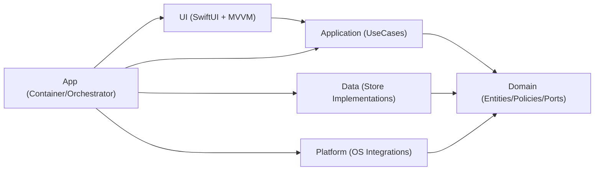
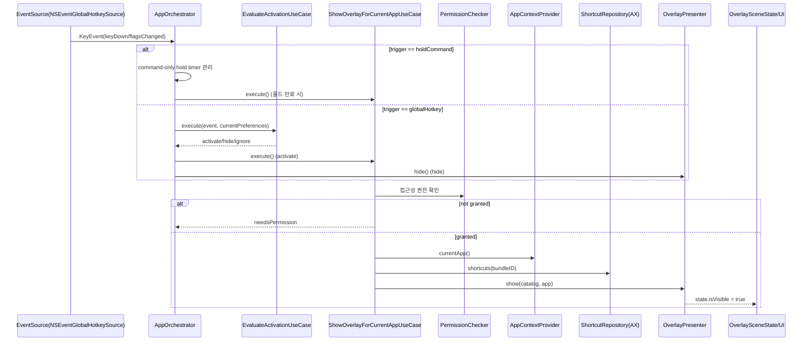
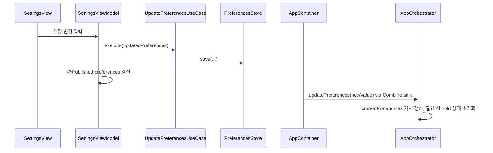
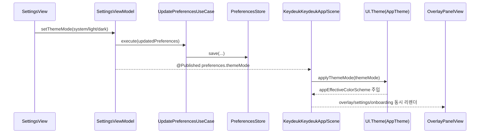
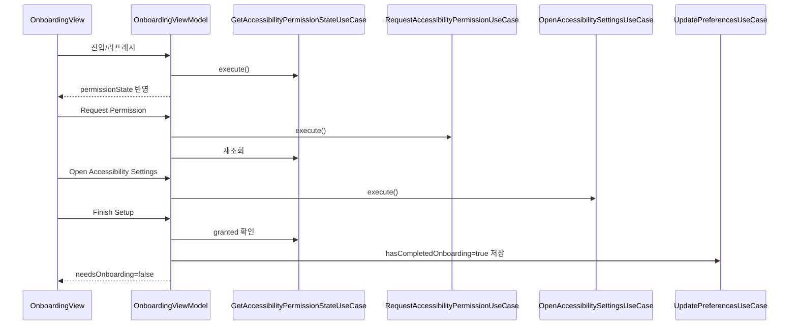
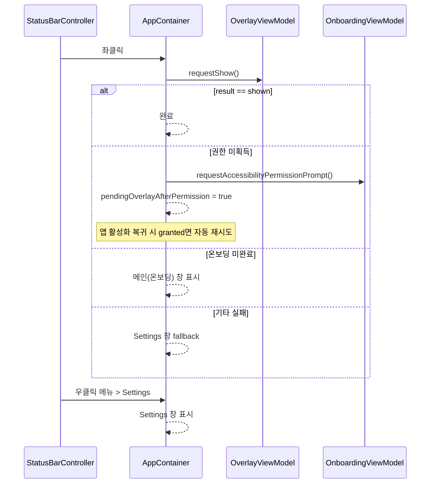

# KeydeukKeydeuk Architecture

## 1) 프로젝트 목적과 아키텍처 방향

KeydeukKeydeuk는 macOS에서 현재 활성 앱의 메뉴 바 단축키를 Accessibility(AX) API로 추출해 오버레이로 보여주는 MVP입니다.

핵심 설계 원칙:

- Clean Architecture: 정책과 구현 디테일을 분리
- MVVM: View는 상태 렌더링, ViewModel은 유스케이스 호출/상태 조합 담당
- 단방향 의존성: `UI -> Application -> Domain`, `Data/Platform -> Domain`
- Orchestrator는 저장소를 직접 참조하지 않고 `Preferences` 값 객체를 캐시해 동작

---

## 2) 레이어 개요

### App 레이어

역할:

- DI 조립(실제 구현체와 유스케이스 결선)
- 앱 수명주기 시작/상태바/윈도우 라우팅
- 키보드 이벤트 기반 오버레이 제어 오케스트레이션

특징:

- `AppContainer`에서 전 구성요소를 생성/연결
- `AppOrchestrator`가 트리거 모드(`holdCommand`, `globalHotkey`) 분기 처리
- 온보딩 완료 시 앱을 accessory 모드로 전환하고 메인 윈도우 숨김

### Domain 레이어

역할:

- 순수 비즈니스 모델/규칙 정의
- 외부 프레임워크(AppKit/SwiftUI/AX/UserDefaults) 비의존

특징:

- `Preferences`, `KeyEvent`, `ActivationDecision` 같은 정책 중심 타입 보유
- `ActivationPolicy`로 핫키 매칭/ESC hide 규칙 캡슐화
- Port(Protocol)로 외부 의존 역전

### Application 레이어

역할:

- 유스케이스 단위로 시나리오 조합
- UI가 호출할 진입점 제공

특징:

- 저장/로딩/권한/오버레이 표시/입력판단을 작은 UseCase로 분할
- 정책은 Domain Policy에 위임, 메커니즘은 Port 구현체에 위임

### Data 레이어

역할:

- 영속화 구현

특징:

- `UserDefaultsPreferencesStore`: `PreferencesStore` 구현
- JSON encode/decode로 설정 저장
- 손상 데이터는 기본값(`Preferences.default`)으로 복구

### Platform 레이어

역할:

- macOS 시스템 연동(입력 이벤트, AX, 권한, 상태바, 창/패널, 현재 앱 감지)

특징:

- Domain Port 구현체 집합
- AppKit/AX API 접근은 이 레이어에 한정

### UI 레이어

역할:

- SwiftUI 화면 렌더링
- ViewModel이 UseCase 호출 결과를 상태로 노출

특징:

- `OnboardingViewModel`, `SettingsViewModel`, `OverlayViewModel`로 역할 분리(SRP)
- `OverlaySceneState`를 shared state로 사용

---

## 3) 실제 디렉터리/컴포넌트 맵

```text
KeydeukKeydeuk/
  App/
    AppContainer.swift
    AppOrchestrator.swift
    KeydeukKeydeukApp.swift
    OverlayPanelController.swift

  Domain/
    Entities/
      Activation.swift
      AppContext.swift
      Permission.swift
      Preferences.swift
      Shortcut.swift
      ShortcutCatalog.swift
    Policies/
      ActivationPolicy.swift
    Protocols/
      Ports.swift

  Application/
    UseCases/
      EvaluateActivationUseCase.swift
      GetAccessibilityPermissionStateUseCase.swift
      HideOverlayUseCase.swift
      LoadPreferencesUseCase.swift
      LoadShortcutsForAppUseCase.swift
      OpenAccessibilitySettingsUseCase.swift
      RequestAccessibilityPermissionUseCase.swift
      ShowOverlayForCurrentAppUseCase.swift
      UpdatePreferencesUseCase.swift

  Data/
    Stores/
      UserDefaultsPreferencesStore.swift

  Platform/
    AppContext/
      NSWorkspaceAppContextProvider.swift
    Input/
      NSEventGlobalHotkeySource.swift
    MenuBar/
      AXMenuBarShortcutRepository.swift
    Overlay/
      OverlayWindowHost.swift
    Permissions/
      AXPermissionChecker.swift
      SystemPermissionGuide.swift
    StatusBar/
      StatusBarController.swift

  UI/
    Onboarding/
      OnboardingView.swift
      OnboardingViewModel.swift
    Overlay/
      AppWindowView.swift
      OverlayPanelView.swift
      OverlaySceneState.swift
      OverlayView.swift
      OverlayViewModel.swift
      RootView.swift
    Settings/
      SettingsView.swift
      SettingsViewModel.swift
      SettingsWindowView.swift
    Theme/
      AppTheme.swift
```

---

## 4) 레이어별 컴포넌트 상세

## App

### `App/KeydeukKeydeukApp.swift`

- SwiftUI 앱 진입점(`@main`)
- `AppContainer`에서 주입된 VM을 Scene에 연결
- 앱 시작 시 `container.start()` 호출
- 루트 Scene에 `applyThemeMode(...)`를 적용해 앱 전역 테마 동기화

### `App/AppContainer.swift`

- 전체 DI 조립 중심
- Port 구현체 생성(Data/Platform)
- UseCase 생성(Application)
- ViewModel 생성(UI)
- `SettingsViewModel.$preferences`를 구독해 `AppOrchestrator.updatePreferences(...)`로 전파
- `SettingsViewModel`을 `OverlayPanelController`에 전달해 오버레이 패널에도 동일 테마 적용
- StatusBar 좌/우클릭 라우팅
- 권한 허용 후 앱 복귀 시 자동 오버레이 표시 처리(`pendingOverlayAfterPermission`)
- 온보딩 상태에 따라 activation policy(`regular`/`accessory`)와 윈도우 표시 상태 제어

### `App/AppOrchestrator.swift`

- `EventSource`를 구독하여 키 이벤트 처리
- 현재 `Preferences`를 내부 캐시(`currentPreferences`)
- 트리거 분기:
  - `holdCommand`: ⌘ 단독 홀드 타이머 만료 시 오버레이 표시
  - `globalHotkey`: `EvaluateActivationUseCase` 결과에 따라 show/hide/ignore
- 트리거 타입 변경 시 홀드 상태 초기화

### `App/OverlayPanelController.swift`

- `OverlaySceneState.isVisible` 구독
- `NSPanel` 생성/표시/숨김 담당
- 마우스 위치 기준 대상 스크린을 찾아 풀스크린 오버레이 패널 표시
- `OverlayPanelView`에 Theme 상태(`SettingsViewModel.selectedThemeMode`) 전달

---

## Domain

### Entities

### `Domain/Entities/Activation.swift`

- `KeyModifiers`(OptionSet)
- `KeyEvent`(keyCode/modifiers/keyDown/flagsChanged)
- `ActivationDecision`(`activate`, `hide`, `ignore`)

### `Domain/Entities/Preferences.swift`

- 트리거 타입, 핫키 키코드/모디파이어, 홀드 시간, auto-hide, 테마 모드, 온보딩 완료 여부
- 기본값(`.default`)과 디코딩 시 기본값 복구 로직 보유

### `Domain/Entities/AppContext.swift`

- 현재 앱 식별 정보(`bundleID`, `appName`)

### `Domain/Entities/Permission.swift`

- `PermissionState`, `PermissionRequirement`

### `Domain/Entities/Shortcut.swift`, `ShortcutCatalog.swift`

- 단축키 단위 모델 / 앱 단위 카탈로그 모델

### Policies

### `Domain/Policies/ActivationPolicy.swift`

- `ActivationPolicy` 추상화
- `DefaultActivationPolicy` 구현:
  - global hotkey 일치 시 `activate`
  - ESC + autoHideOnEsc 시 `hide`
  - 그 외 `ignore`

### Protocols (Ports)

### `Domain/Protocols/Ports.swift`

- 입력, 권한, 저장소, 단축키 조회, 현재 앱 조회, 오버레이 표시 등 외부 경계 인터페이스 정의
- 구현체는 Data/Platform에서 제공

---

## Application (UseCases)

### `EvaluateActivationUseCase`

- `ActivationPolicy` 실행 래퍼

### `GetAccessibilityPermissionStateUseCase`

- 접근성 권한 상태 조회

### `RequestAccessibilityPermissionUseCase`

- 접근성 권한 요청 프롬프트 트리거

### `OpenAccessibilitySettingsUseCase`

- 시스템 접근성 설정 화면 열기

### `LoadPreferencesUseCase`

- 현재 설정 로드

### `UpdatePreferencesUseCase`

- 설정 검증 후 저장
- 최소 검증: keyCode 음수 방지

### `LoadShortcutsForAppUseCase`

- 앱 번들 ID 기준 단축키 카탈로그 조회

### `ShowOverlayForCurrentAppUseCase`

- 오버레이 표시 시나리오 핵심
- 흐름: 권한 체크 -> 현재 앱 조회 -> 단축키 로드(실패 시 빈 카탈로그로 degrade) -> presenter.show
- 반환값으로 상위 라우팅(`shown`, `needsPermission`, `noFocusedApp`)

### `HideOverlayUseCase`

- presenter.hide 호출

---

## Data

### `Data/Stores/UserDefaultsPreferencesStore.swift`

- `PreferencesStore` 구현
- 저장 키: `preferences.v1`
- 디코딩 실패/미존재 시 기본값 반환 + 진단 로그

---

## Platform

### AppContext

### `Platform/AppContext/NSWorkspaceAppContextProvider.swift`

- frontmost app를 `AppContext`로 변환
- self app 제외
- activation notification으로 `lastKnownApp` 캐시 유지

### Input

### `Platform/Input/NSEventGlobalHotkeySource.swift`

- global monitor로 `keyDown` + `flagsChanged` 수집
- local monitor로 앱 포커스 상태에서도 `flagsChanged` 수집(⌘ 릴리즈 감지)
- `NSEvent` -> `KeyEvent` 매핑

### MenuBar

### `Platform/MenuBar/AXMenuBarShortcutRepository.swift`

- AX 트리 순회(`AXApplication -> AXMenuBar -> AXMenuBarItem -> AXMenu -> AXMenuItem`)
- 문자 기반/가상키 기반 단축키 추출
- modifier 비트 조합을 Key symbol(⌘⌥⇧⌃) 문자열로 변환
- 실패 시 빈 카탈로그 반환하여 기능 저하 허용(graceful degradation)

### Overlay

### `Platform/Overlay/OverlayWindowHost.swift`

- `OverlayPresenter` 구현
- 오버레이 표시 시 `OverlaySceneState` 갱신(appName, bundleID, icon, shortcuts, isVisible)
- 앱 아이콘 로딩 담당

### Permissions

### `Platform/Permissions/AXPermissionChecker.swift`

- AX 권한 상태 조회 (`AXIsProcessTrusted`)

### `Platform/Permissions/SystemPermissionGuide.swift`

- AX 권한 프롬프트 요청
- 시스템 접근성 설정 URL 오픈

### StatusBar

### `Platform/StatusBar/StatusBarController.swift`

- Status item 생성(KD)
- 좌클릭: primary action callback
- 우클릭: Settings/Quit 메뉴

---

## UI (View + ViewModel)

### Onboarding

### `UI/Onboarding/OnboardingViewModel.swift`

- 권한 상태 조회/요청/리프레시
- 온보딩 완료 저장(`hasCompletedOnboarding=true`)
- `needsOnboarding`, `permissionHint` 상태 관리

### `UI/Onboarding/OnboardingView.swift`

- 권한 상태 표시/버튼 UI

### Overlay

### `UI/Overlay/OverlaySceneState.swift`

- 오버레이 표시 상태의 단일 소스

### `UI/Overlay/OverlayViewModel.swift`

- `showOverlay`/`hideOverlay` 유스케이스 호출
- 검색 쿼리 기반 단축키 필터링
- `OverlaySceneState` 변화를 ViewModel 객체 변경으로 브리지

### `UI/Overlay/OverlayView.swift`

- 앱 정보 헤더, 검색창, 섹션별 단축키 그리드, 빈 상태 표시
- `ThemePalette` 토큰을 사용해 Light/Dark 톤을 분기 렌더링

### `UI/Overlay/OverlayPanelView.swift`

- 배경 딤 + 탭/ESC hide 트리거
- `applyThemeMode(...)`를 통해 패널 appearance와 colorScheme 적용

### `UI/Overlay/RootView.swift`, `AppWindowView.swift`

- 온보딩/실행중 상태 분기 렌더링

### Settings

### `UI/Settings/SettingsViewModel.swift`

- 설정 읽기/수정 API 제공
- 트리거 타입, 홀드 시간, 프리셋 핫키, auto-hide 토글, 테마 모드 반영
- 저장 실패 시 인라인 오류 메시지 관리

### `UI/Settings/SettingsWindowView.swift`

- 탭 기반 설정 창 컨테이너(General/Theme/Help)
- 활성화 시 권한 상태 리프레시

### `UI/Settings/SettingsView.swift`

- General 탭(Activation/Behavior/Permissions)
- Theme 탭(System/Light/Dark) + Help placeholder

### `UI/Theme/AppTheme.swift`

- `ThemeMode` -> `ColorScheme`/`NSAppearance` 매핑
- `ThemePalette`로 Settings/Overlay 컬러 토큰 중앙 관리
- `applyThemeMode(...)`로 앱 전역 테마/환경값(`appEffectiveColorScheme`) 주입

---

## 5) 정적 의존성(컴파일 타임)



의존성 규칙:

- `UI -> Application -> Domain`
- `Data/Platform -> Domain`
- Domain은 외부 레이어를 모름
- App은 조립/런타임 제어 전용

---

## 6) 런타임 제어 흐름

## 6.1 입력 이벤트 -> 오버레이



## 6.2 Settings 변경 -> Orchestrator 전파



## 6.2-1 Theme 변경 -> 전역 UI 반영



## 6.3 온보딩/권한 획득 흐름



## 6.4 StatusBar 상호작용



---

## 7) 상태/데이터 경계

핵심 상태:

- `Preferences`: 영속 설정 데이터
- `OverlaySceneState`: 오버레이 화면 상태(UI 표시용)
- `OnboardingViewModel.permissionState`: 권한 상태
- `EnvironmentValues.appEffectiveColorScheme`: 테마 해석 결과(UI 렌더링용)

경계:

- Persistent state: `UserDefaultsPreferencesStore`
- Runtime UI state: `OverlaySceneState` + 각 ViewModel `@Published`
- OS integration state: `NSWorkspace`, `NSEvent`, `AX` API 결과

---

## 8) 에러 처리 및 Graceful Degradation

현재 구현 전략:

- 설정 디코딩 실패 -> 기본값으로 복구
- AX 추출 실패/미지원 -> 빈 카탈로그로 오버레이 표시 유지
- 권한 미획득 -> 온보딩/권한 유도 메시지로 분기
- 설정 저장 실패 -> `SettingsViewModel.errorMessage`로 인라인 표시
- 진단 로그: `os.Logger` 카테고리별 기록

---

## 9) 아키텍처 적합성 체크

현재 코드가 지키는 점:

- Domain은 프레임워크 비의존
- UseCase는 Port 의존, 구현체 직접 의존 없음
- UI ViewModel은 Platform 구현체 직접 참조 없음
- Preferences 저장소는 AppContainer 조립 지점에서만 연결
- Orchestrator는 Store 직접 접근 없이 값(`Preferences`)만 사용

주의/개선 후보:

- `PermissionState.denied`는 현재 체커에서 직접 반환되지 않아(대부분 `notDetermined`) 상태 세분화 여지 존재
- `ShowOverlayForCurrentAppUseCase.Result.noCatalog` 케이스는 enum에 있으나 현재 반환 경로는 실질적으로 `shown` 중심
- Domain Port 파일(`Ports.swift`)은 기능별 파일 분리 시 탐색성 향상 가능
- `OverlayPanelController`가 `SettingsViewModel`을 직접 참조(테마 적용 목적)하므로, 향후 `ThemeState` 읽기 모델로 분리하면 액터 경계가 더 명확해짐

---

## 10) 확장 시 권장 절차

1. Domain에 먼저 모델/Port/정책 정의
2. Application에 UseCase 추가(시나리오 단위)
3. Data/Platform에서 Port 구현
4. AppContainer에서 DI 결선
5. ViewModel에 액션/상태 추가, View는 표시/입력만 담당

이 순서를 유지하면 Clean Architecture의 의존성 규칙을 깨지 않고 기능을 확장할 수 있습니다.
